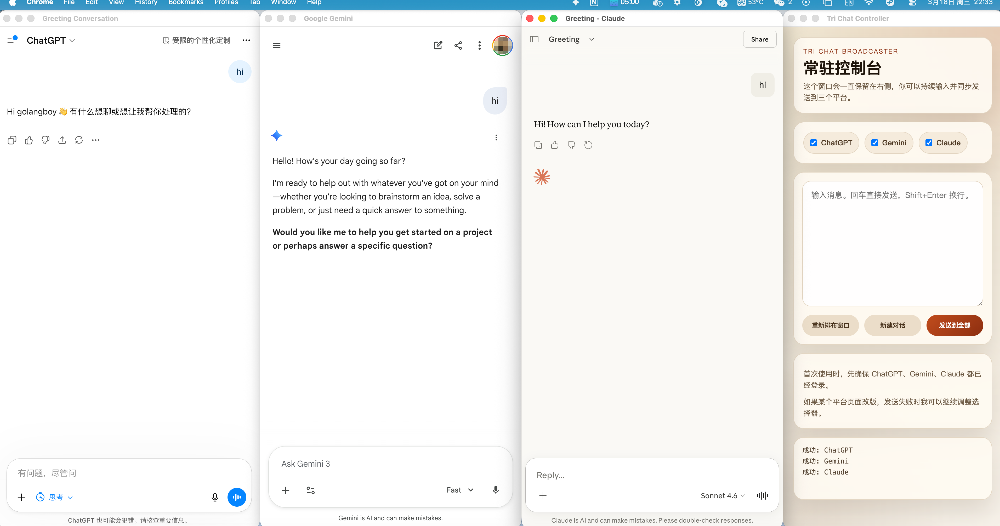

# Prism

一个 Chrome/Chromium 扩展，用来同时打开并平铺：

- ChatGPT: `https://chatgpt.com/`
- Gemini: `https://gemini.google.com/app`
- Claude: `https://claude.ai/new`

从一个常驻控制台窗口输入一条消息，同时发送到三个页面。对比 AI 回答，兼听则明。

## 使用方法

1. 打开 Chrome 的扩展管理页：`chrome://extensions/`
2. 打开右上角“开发者模式”
3. 选择“加载已解压的扩展程序”
4. 选择当前扩展所在的文件夹目录
5. 点击扩展图标
6. 扩展会自动打开四个窗口：
   - 左侧 3 个是 ChatGPT / Gemini / Claude
   - 右侧 1 个是扩展自己的常驻控制台
7. 确认三个站点都已登录，并且页面加载完成
8. 在右侧控制台里持续输入消息，点“发送到全部”

## 已知限制

- 这三个站点通常禁止被扩展页面 iframe 内嵌，所以这里采用“三个独立窗口平铺 + 常驻控制台”的方案。
- 页面 DOM 结构如果改版，发送逻辑可能需要调整 `content-script.js` 里的 selector。
- 第一次使用时，如果浏览器弹出站点权限或登录验证，需要先手动完成。
